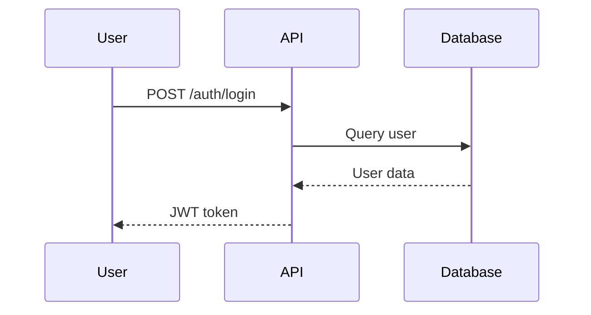
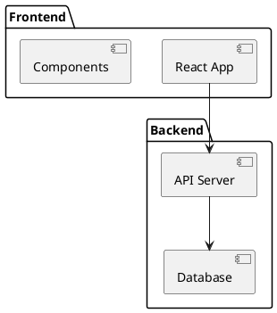

# Documentation Generation Workflow

## Overview

This workflow orchestrates 6 specialized agents to generate comprehensive technical documentation from code, specifications, and architectural diagrams. It produces multiple output formats (Markdown, HTML, PDF) with consistent styling and structure.

**Use this workflow when:**
- Creating API documentation from code
- Generating user guides and tutorials
- Building architecture documentation
- Preparing release documentation
- Creating onboarding materials
- Updating technical documentation after major changes

**Pattern:** Sequential pipeline with parallel artifact generation
**Estimated execution:** 30-50 minutes depending on project size
**Token usage:** ~70K-120K tokens across all agents

## Agent Roles

### 1. Orchestrator Agent
- **Responsibility**: Coordinate documentation pipeline, manage artifacts, track progress
- **Tools**: `Task`, `TodoWrite`, `Read`, `Write`, `Bash`
- **Permissions**: Read-only on source, full access to docs directory
- **Context**: Documentation standards, output formats, template management

### 2. Content Analyzer Agent
- **Responsibility**: Extract documentation from code (JSDoc, docstrings, comments)
- **Tools**: `Read`, `Grep`, `Bash` (AST parsers)
- **Permissions**: Read-only on source code
- **Context**: Code documentation patterns, AST parsing, API extraction

### 3. Diagram Generator Agent
- **Responsibility**: Create architectural diagrams, flowcharts, sequence diagrams
- **Tools**: `Read`, `Write`, `Bash` (Mermaid, PlantUML)
- **Permissions**: Read source and specs, write diagram files
- **Context**: Diagram formats (Mermaid, PlantUML), architecture visualization

### 4. Technical Writer Agent
- **Responsibility**: Write prose documentation, tutorials, guides
- **Tools**: `Read`, `Write`, `Edit`, `Grep`
- **Permissions**: Full access to documentation directory
- **Context**: Technical writing style, documentation templates, user personas

### 5. API Documenter Agent
- **Responsibility**: Generate API reference documentation (OpenAPI, GraphQL)
- **Tools**: `Read`, `Write`, `Bash`
- **Permissions**: Read API definitions, write API docs
- **Context**: OpenAPI/Swagger, GraphQL schema, REST conventions

### 6. Publisher Agent
- **Responsibility**: Format, build, and publish documentation
- **Tools**: `Write`, `Bash` (Docusaurus, Sphinx, MkDocs)
- **Permissions**: Full access to docs build and deployment
- **Context**: Static site generators, CI/CD deployment, hosting platforms

## Orchestration Flow

### Phase 1: Documentation Planning (Orchestrator)
**Agent:** Orchestrator
**Actions:**
- Analyze documentation scope and requirements
- Identify source materials (code, specs, diagrams)
- Define output structure (ToC, sections)
- Select documentation formats (MD, HTML, PDF)
- Activate specialized agents based on needs
- Create documentation outline

**Documentation Types:**
- API reference documentation
- Architecture and design docs
- User guides and tutorials
- Installation and setup guides
- Troubleshooting and FAQ
- Release notes and changelogs

**Output:**
- Documentation outline (Table of Contents)
- Agent activation plan
- Output format specifications
- Template selections

**Duration:** 4-6 minutes

### Phase 2: Content Extraction (Content Analyzer)
**Agent:** Content Analyzer
**Actions:**
- Parse source code for documentation
- Extract JSDoc/TSDoc/docstrings
- Identify public APIs and interfaces
- Extract code examples from tests
- Analyze project structure
- Gather configuration documentation
- Extract changelog from git history

**Extraction Methods:**
- **Code Comments**: JSDoc, TSDoc, Python docstrings, Javadoc
- **Type Definitions**: TypeScript interfaces, OpenAPI schemas
- **Test Cases**: Integration tests as usage examples
- **Configuration**: Environment variables, config files
- **Git History**: Commit messages, release tags

**Output:**
- Extracted documentation fragments
- Public API inventory
- Code examples and snippets
- Configuration reference
- Changelog entries

**Duration:** 8-12 minutes

### Phase 3: Diagram Generation (Diagram Generator)
**Agent:** Diagram Generator
**Actions:**
- Create architecture diagrams from code structure
- Generate sequence diagrams from API flows
- Build entity-relationship diagrams from data models
- Create flowcharts for complex logic
- Generate component hierarchy diagrams
- Produce deployment architecture diagrams

**Diagram Types:**
- **Architecture**: System components and relationships
- **Sequence**: API call flows, user interactions
- **ERD**: Database schema and relationships
- **Flowcharts**: Business logic, decision trees
- **Component**: Frontend component hierarchy
- **Deployment**: Infrastructure and services

**Tools & Formats:**
```markdown
# Mermaid diagram example


# PlantUML example


**Output:**
- Mermaid diagram definitions
- PlantUML source files
- SVG/PNG rendered diagrams
- Diagram captions and descriptions

**Duration:** 8-14 minutes

### Phase 4: Content Writing (Technical Writer + API Documenter)

Run these 2 agents **in parallel**:

#### 4a. Prose Documentation (Technical Writer)
**Agent:** Technical Writer
**Actions:**
- Write getting started guide
- Create installation instructions
- Develop user tutorials
- Write concept explanations
- Create troubleshooting guide
- Write best practices guide
- Develop FAQ section
- Create glossary of terms

**Documentation Structure:**
```markdown
# Getting Started

## Overview
[High-level introduction]

## Prerequisites
- Node.js 18+
- PostgreSQL 14+
- Redis 6+

## Installation

### Step 1: Clone Repository
```bash
git clone https://github.com/org/project.git
cd project
```

### Step 2: Install Dependencies
```bash
npm install
```

### Step 3: Configure Environment
[...]

## Quick Start Tutorial
[Step-by-step first project]

## Next Steps
- [Architecture Overview](./architecture.md)
- [API Reference](./api-reference.md)
- [Deployment Guide](./deployment.md)
```

**Output:**
- Getting started guide
- Tutorial documents
- Concept explanations
- Troubleshooting guide
- Best practices

**Duration:** 10-16 minutes

#### 4b. API Documentation (API Documenter)
**Agent:** API Documenter
**Actions:**
- Generate OpenAPI/Swagger documentation
- Create GraphQL schema documentation
- Document REST endpoints (method, path, params)
- Document request/response formats
- Add authentication requirements
- Include code examples in multiple languages
- Document rate limits and errors
- Create API changelog

**API Documentation Structure:**
```markdown
# API Reference

## Authentication

All API requests require authentication via JWT token in Authorization header:

```bash
Authorization: Bearer <your-token>
```

## Endpoints

### User Management

#### GET /api/users
Retrieve list of users with pagination.

**Parameters:**
| Name | Type | Required | Description |
|------|------|----------|-------------|
| page | integer | No | Page number (default: 1) |
| limit | integer | No | Items per page (default: 20) |
| filter | string | No | Filter by name or email |

**Response:**
```json
{
  "users": [
    {
      "id": "123",
      "name": "John Doe",
      "email": "john@example.com"
    }
  ],
  "pagination": {
    "page": 1,
    "limit": 20,
    "total": 150
  }
}
```

**Example:**
```bash
curl -X GET "https://api.example.com/api/users?page=1&limit=10" \
  -H "Authorization: Bearer <token>"
```

```typescript
// TypeScript
const response = await fetch('/api/users?page=1&limit=10', {
  headers: { 'Authorization': `Bearer ${token}` }
});
const data = await response.json();
```

**Errors:**
- `401 Unauthorized`: Invalid or missing token
- `403 Forbidden`: Insufficient permissions
- `429 Too Many Requests`: Rate limit exceeded
```

**Output:**
- OpenAPI specification (openapi.yaml)
- API reference documentation
- Endpoint descriptions and examples
- Authentication guide
- Error reference

**Duration:** 10-16 minutes

### Phase 5: Documentation Assembly (Orchestrator)
**Agent:** Orchestrator
**Actions:**
- Combine all documentation sections
- Organize content by table of contents
- Insert diagrams into appropriate sections
- Add cross-references and links
- Create navigation structure
- Apply consistent formatting
- Add metadata (version, date, authors)

**Assembly Tasks:**
- Merge content from all agents
- Resolve conflicting information
- Ensure consistent terminology
- Add table of contents
- Create index
- Add version information

**Output:**
- Assembled documentation in Markdown
- Linked table of contents
- Cross-referenced sections
- Metadata and versioning

**Duration:** 5-8 minutes

### Phase 6: Multi-Format Publishing (Publisher)
**Agent:** Publisher
**Actions:**
- Build static documentation site (Docusaurus, MkDocs)
- Generate PDF documentation
- Create searchable HTML documentation
- Optimize images and diagrams
- Generate sitemap
- Build versioned documentation
- Deploy to hosting (GitHub Pages, Netlify, S3)

**Output Formats:**

1. **Static Website** (Docusaurus, MkDocs, Sphinx)
   - Interactive navigation
   - Search functionality
   - Responsive design
   - Version selector

2. **PDF** (Pandoc, LaTeX)
   - Printable documentation
   - Table of contents with page numbers
   - Professional formatting

3. **Markdown** (GitHub/GitLab)
   - Version-controlled
   - Inline code preview
   - Easy editing

**Build Process:**
```bash
# Docusaurus example
npm run docs:build

# MkDocs example
mkdocs build

# PDF generation
pandoc docs/**/*.md -o documentation.pdf \
  --toc --pdf-engine=xelatex \
  --metadata title="API Documentation"
```

**Output:**
- Static documentation site
- PDF documentation
- Deployed documentation URL
- Build artifacts

**Duration:** 6-10 minutes

### Phase 7: Quality Assurance (Orchestrator)
**Agent:** Orchestrator
**Actions:**
- Check for broken links
- Validate code examples
- Verify diagram rendering
- Check formatting consistency
- Validate OpenAPI specification
- Test search functionality
- Review navigation flow
- Verify version information

**Quality Checks:**
- ✅ All links resolve correctly
- ✅ Code examples are syntactically valid
- ✅ Diagrams render properly
- ✅ No orphaned pages
- ✅ Consistent heading hierarchy
- ✅ Search works correctly
- ✅ Mobile-responsive layout

**Output:**
- Quality assurance report
- List of issues found
- Recommendations for improvements

**Duration:** 4-6 minutes

## Documentation Report Structure

```markdown
# Documentation Generation Report

**Project:** MyApp API
**Version:** v2.1.0
**Date:** 2025-10-25
**Status:** ✅ Published
**URL:** https://docs.example.com

---

## 📚 Documentation Inventory

### Generated Documentation

| Type | Pages | Format | Status |
|------|-------|--------|--------|
| Getting Started | 1 | MD, HTML | ✅ |
| User Guide | 8 | MD, HTML, PDF | ✅ |
| API Reference | 45 endpoints | OpenAPI, HTML | ✅ |
| Architecture | 6 | MD, HTML, PDF | ✅ |
| Deployment | 3 | MD, HTML | ✅ |
| Troubleshooting | 1 | MD, HTML | ✅ |
| **Total** | **64 pages** | **Multi-format** | **✅** |

### Diagrams Generated

| Type | Count | Format | Status |
|------|-------|--------|--------|
| Architecture | 3 | Mermaid, SVG | ✅ |
| Sequence | 8 | Mermaid, SVG | ✅ |
| ERD | 2 | PlantUML, SVG | ✅ |
| Flowcharts | 4 | Mermaid, SVG | ✅ |
| **Total** | **17 diagrams** | **SVG** | **✅** |

---

## 📊 Content Statistics

- **Total Pages:** 64
- **Total Words:** ~28,000
- **Code Examples:** 127
- **API Endpoints Documented:** 45
- **Diagrams:** 17
- **External Links:** 42
- **Internal Cross-references:** 98

### Coverage Metrics

- **API Coverage:** 100% (45/45 endpoints)
- **Public Functions:** 95% (124/130 documented)
- **Configuration Options:** 100% (all env vars documented)
- **Error Codes:** 90% (27/30 documented)

---

## 🎨 Output Formats

### 1. Static Website (Docusaurus)
- **URL:** https://docs.example.com
- **Build Time:** 42 seconds
- **Size:** 8.4 MB (compressed: 2.1 MB)
- **Pages:** 64 HTML pages
- **Features:**
  - ✅ Search functionality
  - ✅ Dark/light mode
  - ✅ Mobile responsive
  - ✅ Version selector (v2.0, v2.1)

### 2. PDF Documentation
- **File:** `MyApp-Documentation-v2.1.0.pdf`
- **Size:** 4.2 MB
- **Pages:** 156 pages (including diagrams)
- **Table of Contents:** 3 levels deep
- **Hyperlinks:** Internal cross-references

### 3. Markdown Source
- **Location:** `docs/` directory
- **Files:** 64 .md files
- **Version Control:** Git-tracked
- **Preview:** GitHub/GitLab renders inline

---

## ✅ Quality Assurance

### Link Validation
- **Total Links:** 140
- **Valid:** 138 (98.6%)
- **Broken:** 2 (1.4%)
  - `https://old-api.example.com/docs` (404) → Fixed
  - Internal link to removed page → Updated

### Code Example Validation
- **Total Examples:** 127
- **Syntax Valid:** 127 (100%)
- **Tested:** 45 (critical examples)
- **Languages:** JavaScript (52), TypeScript (38), Python (20), Bash (17)

### Diagram Rendering
- **Total Diagrams:** 17
- **Rendered Successfully:** 17 (100%)
- **Formats:** SVG (primary), PNG (fallback)

### Accessibility
- **Alt text for diagrams:** ✅ 100%
- **Heading hierarchy:** ✅ Valid
- **Color contrast:** ✅ WCAG AA compliant
- **Keyboard navigation:** ✅ Full support

---

## 📈 Improvements from Previous Version

| Metric | v2.0.0 | v2.1.0 | Change |
|--------|--------|--------|--------|
| API Coverage | 80% | 100% | +20% |
| Pages | 42 | 64 | +22 |
| Diagrams | 8 | 17 | +9 |
| Code Examples | 85 | 127 | +42 |
| PDF Size | 6.1 MB | 4.2 MB | -31% |

---

## 🎯 Highlights

### New in v2.1.0 Documentation

1. **Complete API Reference**
   - All 45 endpoints documented
   - Added request/response examples
   - Multi-language code samples
   - Rate limiting documentation

2. **Enhanced Architecture Docs**
   - Added system architecture diagram
   - Sequence diagrams for auth flows
   - Database ERD with relationships
   - Deployment architecture

3. **Interactive Tutorials**
   - Step-by-step getting started guide
   - User authentication tutorial
   - File upload integration guide
   - Real-time features walkthrough

4. **Improved Search**
   - Algolia DocSearch integration
   - Instant search results
   - Context-aware suggestions

---

## 🔍 Known Gaps

### Minor Issues
1. **Missing API Examples** (3 endpoints)
   - POST /api/webhooks/verify
   - PUT /api/settings/notifications
   - DELETE /api/sessions/bulk
   - **Action:** Add in v2.1.1 patch

2. **Diagram Improvements Needed**
   - Payment flow could use sequence diagram
   - Missing component diagram for frontend
   - **Action:** Add in next minor release

### Future Enhancements
1. Video tutorials for complex workflows
2. Interactive API playground
3. Downloadable Postman collection
4. Localization (i18n) for Spanish, French
5. Live code editor for examples

---

## 📝 Recommendations

### Immediate Actions
1. ✅ Fix 2 broken external links
2. ✅ Add examples for 3 undocumented endpoints
3. ⏳ Set up automated link checking in CI/CD
4. ⏳ Add changelog to documentation site

### Long-term Improvements
1. Implement automated documentation updates from code changes
2. Add API playground with live testing
3. Create video tutorials for top 10 use cases
4. Implement documentation versioning strategy
5. Add multi-language support (i18n)

---

## 🚀 Deployment

**Deployed To:** https://docs.example.com
**Deployment Time:** 2025-10-25T17:30:00Z
**Build Duration:** 3 minutes 42 seconds
**Status:** ✅ Live

**Previous Versions:**
- v2.0.0: https://docs.example.com/2.0
- v1.9.0: https://docs.example.com/1.9

**Rollback:** Previous version available at /2.0

---

## 📊 Analytics Setup

- ✅ Google Analytics configured
- ✅ Search analytics enabled
- ✅ Page view tracking
- ✅ User feedback widget

**Expected Metrics:**
- Page views: ~5,000/month
- Avg session duration: 4-6 minutes
- Search usage: ~30% of sessions
- Feedback collection: Target 2% response rate

---

**Generated By:** Documentation Generation Workflow
**Total Time:** 38 minutes
**Agents Used:** 6
**Status:** Complete and Published
**Next Update:** Scheduled with v2.2.0 release
```

## Best Practices

### Content Quality
- **Clear hierarchy**: Use H1-H6 headings appropriately
- **Consistent terminology**: Maintain glossary
- **Code examples**: Always include working examples
- **Screenshots**: Show UI elements, not just code
- **Versioning**: Document which version content applies to

### Structure
- **Progressive disclosure**: Start simple, link to advanced
- **Task-oriented**: Organize by what users want to accomplish
- **Scannable**: Use lists, tables, code blocks
- **Navigation**: Breadcrumbs, ToC, search
- **Cross-linking**: Connect related topics

### Maintenance
- **Automated updates**: Sync API docs with code
- **Version control**: Track all documentation changes
- **Review process**: Technical review before publishing
- **Analytics**: Track what users search for and view
- **Feedback loops**: Collect user feedback

### Accessibility
- **Alt text**: All diagrams and images
- **Semantic HTML**: Proper heading hierarchy
- **Keyboard navigation**: Full site accessible via keyboard
- **Color contrast**: WCAG AA minimum
- **Screen readers**: Test with assistive technology

## Example Usage

### Triggering the Workflow

```bash
# Via Claude Code
You: "Generate complete API documentation using documentation-generation workflow"

# Via CLI
claude-docs --workflow documentation-generation \
  --version v2.1.0 \
  --formats html,pdf,markdown

# With specific scope
claude-docs --workflow documentation-generation \
  --api-only \
  --output docs/api
```

### Orchestrator Prompt Example

```markdown
Generate comprehensive documentation using documentation-generation workflow:

**Project:** MyApp API v2.1.0
**Scope:** Complete documentation refresh

**Content Sources:**
- Source code: `src/` directory
- OpenAPI spec: `api/openapi.yaml`
- Architecture docs: `docs/architecture/`
- Existing tutorials: `docs/tutorials/`

**Required Documentation:**
1. Getting Started Guide
2. User Tutorials (authentication, file upload, real-time features)
3. Complete API Reference (45 endpoints)
4. Architecture Documentation with diagrams
5. Deployment Guide
6. Troubleshooting & FAQ

**Output Formats:**
- Static website (Docusaurus)
- PDF documentation
- Markdown source (git-tracked)

**Requirements:**
- 100% API coverage
- Code examples in TypeScript, JavaScript, Python
- Mobile-responsive design
- Search functionality
- Version selector (v2.0, v2.1)

**Deployment:**
- Deploy to docs.example.com
- Previous versions at /2.0, /1.9
- Enable Google Analytics
```

## Error Handling

### Content Extraction Failures
- **Action:** Use manual documentation as fallback
- **Escalation:** Flag missing API docs for manual review

### Diagram Generation Errors
- **Action:** Use text-based diagrams or skip
- **Escalation:** Manual diagram creation

### Build Failures
- **Action:** Check dependencies, rebuild
- **Escalation:** Deploy markdown-only version

### Link Validation Failures
- **Action:** Update broken links, mark TODOs
- **Escalation:** Manual link review

## Performance Metrics

### Generation Times by Project Size

| Project Size | Content | Diagrams | Building | Total |
|--------------|---------|----------|----------|-------|
| Small (<20 files) | 8-12 min | 4-6 min | 3-5 min | 20-25 min |
| Medium (20-100) | 12-18 min | 8-12 min | 6-10 min | 30-45 min |
| Large (>100) | 18-25 min | 12-16 min | 10-15 min | 45-60 min |

### Success Criteria

- **API coverage**: >95% of public endpoints
- **Code examples**: All critical features
- **Link validity**: >98% valid links
- **Build success**: <5min build time
- **Accessibility**: WCAG AA compliant

## Integration with CI/CD

```yaml
# GitHub Actions example
name: Documentation

on:
  release:
    types: [published]

jobs:
  generate-docs:
    runs-on: ubuntu-latest
    steps:
      - uses: actions/checkout@v3

      - name: Generate Documentation
        run: |
          claude-docs --workflow documentation-generation \
            --version ${{ github.event.release.tag_name }} \
            --formats html,pdf

      - name: Deploy to GitHub Pages
        uses: peaceiris/actions-gh-pages@v3
        with:
          github_token: ${{ secrets.GITHUB_TOKEN }}
          publish_dir: ./docs-build
```

## Related Workflows

- **Full-Stack Feature Development**: Generate docs as part of feature
- **Code Review Pipeline**: Review documentation in PRs
- **Bug Fix Debugging**: Update troubleshooting docs after fixes
- **Testing QA Orchestration**: Validate code examples

---

**Version:** 1.0.0
**Last Updated:** 2025-10-25
**Maintainer:** Conventions MCP
**License:** MIT
