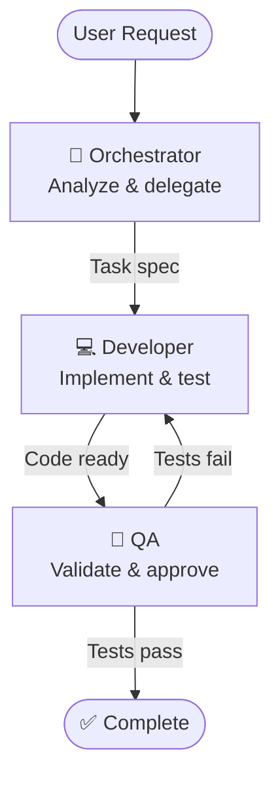

# Agent Architecture & Implementation Plan

**Last Updated**: 2025-12-03
**Overall Status**: Phase 1 ✅ Complete | Phase 2-3 📋 Planned

## Current Implementation Status

### Phase 1: Skills, Plugins & MCP Servers ✅

| Component | Status | Summary |
|-----------|--------|---------|
| **Skills** | ✅ Complete | 12 base + 6 plugin skills accessible via Skill tool |
| **Plugins** | ⚠️ Workaround | SDK bug prevents native loading; manual discovery active |
| **MCP Servers** | ✅ Complete | 9 servers (6 in-process + 3 subprocess) |

**Key Files**: `src/harness/agent.py`, `src/harness/mcp_loader.py`, `.claude/.mcp.json`

**Architecture**: Clean workspace separation (`/app` for config, `/workspace` for development)

### Upcoming Phases

- **Phase 2: Agent Definitions** - Hard-coded `AgentDefinition` objects for multi-agent orchestration
- **Phase 3: Documentation** - Examples and usage guides

---

## Table of Contents

- [Phase 1: Skills, Plugins & MCP](#phase-1-skills-plugins--mcp)
- [Phase 2: Multi-Agent Architecture](#phase-2-multi-agent-architecture)
- [Phase 3: Documentation & Examples](#phase-3-documentation--examples)

---

## Phase 1: Skills, Plugins & MCP

**Status**: ✅ Complete (2025-12-02)

### Skills (12 base + 6 plugin)

All skills accessible via Skill tool from `/app/.claude/skills/`.

**Base Skills**: api-development, code-review, database-management, debugging, deployment-operations, documentation, frontend-development, git-workflow, microservices-architecture, performance-optimization, security, testing-strategies

**Plugin Skills**: agent-definition-creation, skill-creation, plugin-development, command-creation, hook-configuration, joplin-research

### Plugins (⚠️ SDK Workaround Active)

3 plugins configured but blocked by SDK bug. Plugin skills work via manual discovery.

**Installed Plugins**: arch, context-engineering, research-team

**SDK Bug**: Python SDK v0.1.9 accepts `plugins` parameter but Claude CLI subprocess doesn't load them.
- [claude-code#11620](https://github.com/anthropics/claude-code/issues/11620)
- [claude-agent-sdk-python#213](https://github.com/anthropics/claude-agent-sdk-python/issues/213)

**When SDK Is Fixed**:
1. Verify `SystemMessage.data.get("plugins")` returns plugin list
2. Remove `_load_plugin_skills_manually()` from `agent.py`
3. Test: `tests/integration/test_sdk_plugin_awareness.py`

### MCP Servers (9 total)

| Type | Servers |
|------|---------|
| **In-Process** | git, docker, context7, memory, github, gitlab |
| **Subprocess (npx)** | playwright, joplin |
| **Subprocess (uvx)** | excel-haris-musa |

API key validation with graceful degradation for github, gitlab, joplin.

### Architecture: Clean Workspace Separation

```
Container Filesystem:
├── /app/.claude/           # System config (READ-ONLY) - skills, agents, specs
└── /workspace/             # Development work - clone repos here
```

**Key Configuration** (`src/harness/agent.py`):
- `cwd="/app"` - SDK finds skills at `/app/.claude/skills/`
- `setting_sources=["user", "project"]` - Enable skill discovery
- Docker mount: `./.claude:/app/.claude:ro`

---

## Phase 2: Multi-Agent Architecture

**Status**: 📋 Planned
**Complexity**: Medium

### Philosophy

Start simple, prove the concept, then scale complexity incrementally. A minimal viable agentic team that demonstrates core concepts without overwhelming complexity.

### Target Architecture: 3-Agent Team



**Agent Roles**:
| Agent | Responsibilities | Autonomy |
|-------|------------------|----------|
| **Orchestrator** | Parse requests, break down tasks, coordinate handoffs | Medium |
| **Developer** | Implement code, write tests, self-review | High |
| **QA** | Run tests, validate criteria, approve/reject | Medium |

**Workflow Patterns**:
- **Feature**: Request → Orchestrator → Developer → QA → Complete
- **Bug Fix**: Report → Orchestrator → Developer → QA → Complete
- **Iterative**: Implementation → QA Feedback → Refinement → Re-test

### Implementation Approach

Hard-coded `AgentDefinition` objects following SDK best practices (based on research-agent demo):

- Prompts in separate `.txt` files
- Lead agent delegates via Task tool
- Specialists have complementary toolsets
- 6 core agents covering major use cases

### Implementation Steps

#### Step 1: Create prompts directory structure

```bash
mkdir -p src/harness/prompts
```

#### Step 2: Extract prompts from existing agents

Choose 6 core agents that cover major use cases:

1. **dev-python-expert** → Python development
2. **dev-typescript-expert** → TypeScript/JavaScript
3. **infra-docker-expert** → Container management
4. **db-postgres-expert** → Database design
5. **code-reviewer** → Code review and security
6. **doc-writer** → Documentation creation

**Example prompt extraction** (from `.claude/agents/dev-python-expert.md`):

```bash
# Extract system prompt (everything after YAML frontmatter)
sed -n '/^---$/,/^---$/!p' .claude/agents/dev-python-expert.md > src/harness/prompts/python_expert.txt
```

#### Step 3: Create agent definitions module

**File**: `src/harness/agents/definitions.py`

```python
"""Hard-coded agent definitions following SDK best practices."""

from pathlib import Path
from claude_agent_sdk import AgentDefinition


def load_prompt(filename: str) -> str:
    """Load prompt from text file."""
    prompt_path = Path(__file__).parent.parent / "prompts" / filename
    return prompt_path.read_text()


# Core hard-coded agent definitions
CORE_AGENTS = {
    "python-expert": AgentDefinition(
        description=(
            "Use this agent when you need expert Python development assistance. "
            "Handles Python code review, implementation, debugging, testing, and best practices. "
            "Specializes in modern Python (3.12+), type hints, async/await, and testing."
        ),
        tools=["Read", "Write", "MultiEdit", "Bash", "Grep", "Glob", "Skill"],
        prompt=load_prompt("python_expert.txt"),
        model="sonnet"
    ),

    "typescript-expert": AgentDefinition(
        description=(
            "Use this agent for TypeScript and JavaScript development. "
            "Handles React, Node.js, API development, and frontend/backend TypeScript code. "
            "Specializes in type-safe code, modern ES features, and testing."
        ),
        tools=["Read", "Write", "MultiEdit", "Bash", "Grep", "Glob", "Skill"],
        prompt=load_prompt("typescript_expert.txt"),
        model="sonnet"
    ),

    "docker-expert": AgentDefinition(
        description=(
            "Use this agent for Docker and container-related tasks. "
            "Handles Dockerfile creation, docker-compose configuration, container debugging, "
            "and container orchestration. Integrates with Docker MCP server."
        ),
        tools=["Read", "Write", "Bash", "mcp__docker", "Skill"],
        prompt=load_prompt("docker_expert.txt"),
        model="haiku"
    ),

    "postgres-expert": AgentDefinition(
        description=(
            "Use this agent for PostgreSQL database design and optimization. "
            "Handles schema design, query optimization, migrations, and database best practices."
        ),
        tools=["Read", "Write", "Skill"],
        prompt=load_prompt("postgres_expert.txt"),
        model="haiku"
    ),

    "code-reviewer": AgentDefinition(
        description=(
            "Use this agent for code review, security audit, and quality assessment. "
            "Provides detailed feedback on code quality, security vulnerabilities, "
            "and best practices. Read-only access to preserve code integrity."
        ),
        tools=["Read", "Grep", "Glob"],  # Read-only
        prompt=load_prompt("code_reviewer.txt"),
        model="sonnet"
    ),

    "doc-writer": AgentDefinition(
        description=(
            "Use this agent for technical documentation and README creation. "
            "Handles API documentation, user guides, architecture docs, and markdown formatting."
        ),
        tools=["Read", "Write", "Skill", "Glob"],
        prompt=load_prompt("doc_writer.txt"),
        model="haiku"
    ),
}


def get_lead_agent_prompt() -> str:
    """Get lead agent system prompt for orchestration."""
    return load_prompt("lead_agent.txt")
```

#### Step 4: Create lead agent orchestrator prompt

**File**: `src/harness/prompts/lead_agent.txt`

```txt
You are the Lead Software Architect for the Claude Agent SDK Harness.

Your role is to coordinate and delegate tasks to specialized agents using the Task tool.

## Available Specialized Agents

You have access to 6 expert agents:

1. **python-expert** - Python development, testing, debugging
2. **typescript-expert** - TypeScript/JavaScript, React, Node.js
3. **docker-expert** - Container management, Dockerfile, docker-compose
4. **postgres-expert** - Database design, SQL, migrations
5. **code-reviewer** - Code review, security audit (read-only)
6. **doc-writer** - Documentation, README, API docs

## Delegation Strategy

- **Single-language tasks**: Delegate to language expert (python-expert, typescript-expert)
- **Infrastructure**: Delegate to docker-expert
- **Database work**: Delegate to postgres-expert
- **Code review**: Always delegate to code-reviewer after implementation
- **Documentation**: Delegate to doc-writer for final docs

## Workflow Pattern

1. **Analyze request** - Determine which expert(s) are needed
2. **Delegate to specialist** - Use Task tool with clear instructions
3. **Review results** - Ensure quality before proceeding
4. **Coordinate multi-step** - Break complex tasks into agent-specific steps

## Important Rules

- ALWAYS delegate - never implement code yourself
- ONE agent per task (avoid multi-agent confusion)
- CLEAR instructions - be specific in Task tool prompts
- VERIFY results before marking tasks complete

Example delegation:
```
Task: "Use python-expert to refactor the checkpoint.py module following SOLID principles"
```
```

#### Step 5: Update agent.py to use hard-coded definitions

**File**: `src/harness/agent.py`

```python
# Add imports
from harness.agents.definitions import CORE_AGENTS, get_lead_agent_prompt

# In AgentSession.__init__
def __init__(
    self,
    agent_name: str = "lead",  # Changed default to "lead"
    config: HarnessConfig | None = None,
    checkpoint_manager: CheckpointManager | None = None,
    metrics_collector: MetricsCollector | None = None,
) -> None:
    """Initialize agent session with hard-coded agent definitions."""
    self.agent_name = agent_name
    self.config = config or get_config()

    # ... checkpoint and metrics setup ...

    # Register MCP servers
    self.mcp_servers = { ... }

    logger.info(
        "Agent session initialized",
        agent=agent_name,
        session_id=self.session_id,
        available_agents=list(CORE_AGENTS.keys()),
    )


# In _execute_with_retry
async def _execute_with_retry(
    self,
    prompt: str,
    **kwargs: Any,
) -> AsyncGenerator[dict[str, Any], None]:
    """Execute with multi-agent configuration."""

    # Configure with hard-coded agents
    options = ClaudeAgentOptions(
        permission_mode=self.config.claude_permission_mode,
        max_turns=self.config.claude_max_turns,
        cwd=str(self.config.workspace_dir),
        model=self.config.claude_model,
        mcp_servers=self.mcp_servers,
        setting_sources=["user", "project"],  # Enable skills
        system_prompt=get_lead_agent_prompt(),  # Lead agent orchestrator
        allowed_tools=["Task"],  # Lead agent only delegates
        agents=CORE_AGENTS,  # 6 specialized agents
    )

    # ... rest of method ...
```

#### Step 6: Update interactive.py

**File**: `src/harness/interactive.py`

```python
from harness.agents.definitions import CORE_AGENTS

def print_welcome_banner(console: Console, agent_name: str, model: str) -> None:
    """Print welcome banner with available agents."""
    banner = Panel(
        f"""[bold cyan]Claude Agent SDK Harness[/bold cyan]

Lead Agent: [green]{agent_name}[/green]
Model: [yellow]{model}[/yellow]
Mode: Multi-Agent Orchestration

Available Specialized Agents:
{', '.join(f'[green]{name}[/green]' for name in CORE_AGENTS.keys())}

Type your request and the lead agent will delegate to specialists.
Press Ctrl+C to exit.
""",
        title="🤖 Claude Agent Harness",
        border_style="cyan",
    )
    console.print(banner)


async def main(model: str | None = None, show_stats: bool = False, quiet: bool = False) -> None:
    """Run interactive session with multi-agent orchestration."""
    # ... setup ...

    # Always use "lead" agent in this mode
    agent_name = "lead"
    session = AgentSession(agent_name=agent_name, config=config)

    # ... rest of main ...
```

### Directory Structure After Implementation

```
src/harness/
├── agents/
│   ├── __init__.py
│   └── definitions.py          # Hard-coded AgentDefinition objects
├── prompts/
│   ├── lead_agent.txt          # Lead orchestrator prompt
│   ├── python_expert.txt       # Extracted from .claude/agents/dev-python-expert.md
│   ├── typescript_expert.txt   # Extracted from .claude/agents/dev-typescript-expert.md
│   ├── docker_expert.txt       # Extracted from .claude/agents/infra-docker-expert.md
│   ├── postgres_expert.txt     # Extracted from .claude/agents/db-postgres-expert.md
│   ├── code_reviewer.txt       # Extracted from .claude/agents/code-reviewer.md
│   └── doc_writer.txt          # Extracted from .claude/agents/doc-writer.md
└── agent.py                    # Updated to use CORE_AGENTS
```

### Usage Example

```bash
# Start interactive session
make dev

# Lead agent delegates automatically
> "Refactor the checkpoint.py module to follow SOLID principles"

# Lead agent will:
# 1. Analyze request
# 2. Delegate to python-expert via Task tool
# 3. Python-expert implements changes
# 4. Lead agent delegates to code-reviewer
# 5. Code-reviewer provides feedback
# 6. Optionally delegate to doc-writer for updated docstrings
```

### Testing

```python
# tests/integration/test_multi_agent.py
import pytest
from harness.agent import AgentSession
from harness.agents.definitions import CORE_AGENTS


@pytest.mark.integration
async def test_agent_delegation():
    """Test lead agent delegates to specialists."""
    session = AgentSession(agent_name="lead")
    await session.start()

    # Lead agent should delegate Python tasks
    async for message in session.execute("Write a Python function to calculate fibonacci"):
        # Should see delegation to python-expert
        if "Task" in message.get("tool_use", {}).get("name", ""):
            assert "python-expert" in message["tool_use"]["input"].get("subagent_type", "")

    await session.shutdown()


def test_core_agents_defined():
    """Verify all core agents are properly defined."""
    assert len(CORE_AGENTS) == 6

    for name, agent_def in CORE_AGENTS.items():
        assert agent_def.description
        assert agent_def.tools
        assert agent_def.prompt
        assert agent_def.model in ["sonnet", "haiku", "opus"]
```

### Migration Path for Existing 44 Agents

The remaining 38 agents in `.claude/agents/` can be:

1. **Referenced on-demand** - Lead agent can still READ them when needed
2. **Converted to skills** - Move to `.claude/skills/` for reference documentation
3. **Added incrementally** - Promote frequently-used agents to hard-coded status
4. **Kept as documentation** - Valuable reference material

**Hybrid approach**:
```python
# Lead agent prompt addition
"""
## Extended Agent Library

Beyond your 6 core agents, you have access to 38 additional specialized agents
in .claude/agents/. If none of your core agents fit a task, you can:

1. READ the appropriate agent file from .claude/agents/
2. ADOPT that agent's persona temporarily
3. Complete the task following their guidelines

Example: For Julia language tasks, READ .claude/agents/dev-julia-expert.md
and follow its instructions.
"""
```

### Benefits

- ✅ Uses SDK's native multi-agent system (AgentDefinition)
- ✅ Follows official reference implementation pattern
- ✅ Prompts in separate files (maintainable, version-controlled)
- ✅ Lead agent orchestrates via Task tool (clear separation)
- ✅ Specialists have complementary toolsets
- ✅ Clean, professional codebase
- ✅ Easy to test and extend
- ✅ Still has access to remaining 38 agents via Read tool

---

## Phase 3: Documentation & Examples

**Timeline**: 30 minutes
**Complexity**: Low
**Risk**: Minimal

### Overview

Create documentation and examples showing how to use skills and agent definitions.

### Deliverables

#### 1. Update README.md

Add section:
```markdown
## Using Skills and Agents

### Skills

The harness includes 12 pre-configured skills for common development tasks:

```bash
# Start interactive session
make dev

# Use a skill (in chat)
/skill api-development
```

Available skills:
- `api-development` - REST and GraphQL patterns
- `code-review` - Review workflows
- `database-management` - Database design
- `debugging` - Troubleshooting guides
- And 8 more...

### Agent Definitions

6 specialized agents are available for different tasks:

```bash
# Start interactive session with multi-agent orchestration
make dev

# Lead agent automatically delegates to specialists:
# - python-expert, typescript-expert, docker-expert
# - postgres-expert, code-reviewer, doc-writer
```

The lead agent analyzes your request and delegates to the appropriate specialist.

#### Extended Agent Library

38 additional agents are available in `.claude/agents/` for reference. The lead agent can read and adopt these personas when needed for specialized tasks (Julia, Rust, Go, ML frameworks, etc.).
```

#### 2. Create Example Workflow

**File**: `examples/skill_usage.py`

```python
"""Example: Using skills in agent sessions."""

import asyncio
from harness.agent import AgentSession


async def main():
    """Demonstrate skill usage."""
    session = AgentSession(agent_name="main")
    await session.start()

    # Agent can now use skills
    prompt = """
    I need to design a REST API for user management.
    Use the api-development skill to help guide the design.
    """

    async for message in session.execute(prompt):
        print(message)

    await session.shutdown()


if __name__ == "__main__":
    asyncio.run(main())
```

**File**: `examples/multi_agent_workflow.py`

```python
"""Example: Multi-agent orchestration workflow."""

import asyncio
from harness.agent import AgentSession


async def main():
    """Demonstrate multi-agent delegation."""
    session = AgentSession(agent_name="lead")
    await session.start()

    # Lead agent orchestrates specialists
    prompt = """
    Refactor the checkpoint.py module to follow SOLID principles.
    After implementation, have the code reviewer audit it.
    Update documentation with any architectural changes.
    """

    async for message in session.execute(prompt):
        print(message)

    await session.shutdown()


if __name__ == "__main__":
    asyncio.run(main())
```

#### 3. Update CLAUDE.md

Add section showing agents are now auto-discovered:
```markdown
## Agent Definitions

The harness uses a hybrid multi-agent system:

### Core Agents (Hard-Coded)
6 specialist agents automatically available via lead agent delegation:
- `python-expert` - Python development, testing, debugging
- `typescript-expert` - TypeScript/JavaScript, React, Node.js
- `docker-expert` - Container management and orchestration
- `postgres-expert` - Database design and optimization
- `code-reviewer` - Code review and security audit
- `doc-writer` - Technical documentation

### Extended Agent Library (Reference)
38 additional agents in `.claude/agents/` available on-demand:
- Agents organized by prefix: `dev-*`, `db-*`, `infra-*`, `ml-*`, `web-*`
- Lead agent can READ and adopt these personas when needed
- Covers specialized languages (Julia, Rust, Go, etc.) and frameworks

### Skills
12 skills auto-discovered from `.claude/skills/`:
- Available via `/skill` command in interactive mode
- Covers API development, testing, security, performance, etc.

See README.md for complete usage examples.
```
