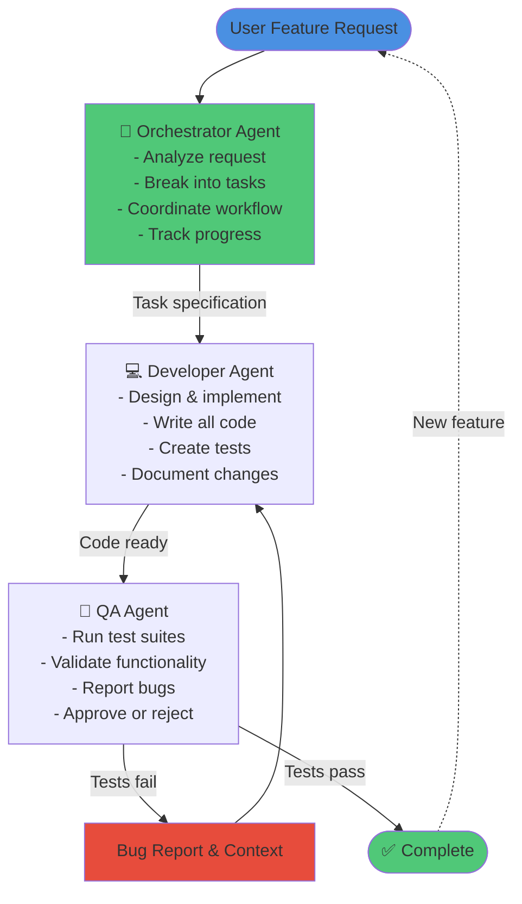

# Agent Architecture & Implementation Plan

**Last Updated**: 2025-12-02
**Overall Status**: Phase 1 ✅ | Phase 1B ⚠️ WORKAROUND | Phase 1C ✅ | Phase 2-3 Planned

## Current Implementation Status

- **Phase 1: Native Skill Support** - ✅ **IMPLEMENTED** (2025-11-21)
  - All 12 skills accessible from `/app/.claude/skills/`
  - Docker mounts `.claude` to `/app/.claude:ro` (all 3 agents)
  - "Skill" added to allowed_tools
  - setting_sources configured with ["user", "project"]
  - Integration tests created and passing (4 tests)
  - Clean workspace architecture: /app for config, /workspace for development

- **Phase 1B: Plugin Loading via SDK** - ⚠️ **WORKAROUND IMPLEMENTED** (2025-11-25)
  - ✅ Created plugin manifests (.claude-plugin/plugin.json) for 3 plugins with resource paths
  - ✅ Added plugins parameter to ClaudeAgentOptions in agent.py
  - ✅ Added comprehensive SDK verification tests (test_sdk_plugin_awareness.py)
  - ⚠️ SDK not loading plugins - known bug (GitHub issues #11620, #213)
  - ✅ **Workaround**: Manual plugin skill discovery implemented in agent.py
  - ✅ Plugin skills (6 total) now accessible via Skill tool
  - **Status**: Functional via workaround, will be updated when SDK bug is fixed

- **Phase 1C: MCP Server Configuration & Loading** - ✅ **COMPLETED** (2025-12-02)
  - Hybrid architecture: 6 in-process + 2 subprocess servers
  - API key validation with graceful degradation
  - GitLab MCP server added (not in original plan)

- **Phase 2: Hard-Coded Agent Definitions** - 📋 **PLANNED** (Not Started)

- **Phase 3: Documentation & Examples** - 📋 **PLANNED** (Not Started)

---

## Table of Contents

- [Overview: Simplified 3-Agent Starter Architecture](#overview-simplified-3-agent-starter-architecture)
- [Phase 1: Enable Native Skill Support](#phase-1-enable-native-skill-support)
- [Phase 1B: MCP Tools & Plugin Marketplace](#phase-1b-mcp-tools--plugin-marketplace)
- [Phase 2: Hard-Coded Agent Definitions](#phase-2-hard-coded-agent-definitions)
- [Phase 3: Documentation & Examples](#phase-3-documentation--examples)
- [Implementation Roadmap](#implementation-roadmap)

---

## Overview: Simplified 3-Agent Starter Architecture

### Philosophy

Start simple, prove the concept, then scale complexity incrementally based on actual needs rather than theoretical requirements.

A minimal viable agentic team that demonstrates core concepts without overwhelming complexity. Perfect for initial implementation, learning the Claude Agent SDK patterns, and validating the multi-agent approach before scaling to a full architecture.

### Starter Team DAG



### Agent Definitions

#### Orchestrator Agent
**Primary Responsibilities**:
- Parse user requests and identify required work
- Break down features into manageable tasks
- Coordinate handoffs between Developer and QA
- Track project state and progress
- Handle exceptions and blockers

**Key Skills/Tools**:
- Sequential Thinking MCP for task analysis
- Memory MCP for project state tracking
- Filesystem MCP for reading project context
- Git MCP for repository information

**Autonomy Level**: Medium - makes decisions about task breakdown but escalates ambiguities

**Example System Prompt Elements**:
```
You are the Orchestrator Agent responsible for coordinating software development.

Your primary duties:
1. Analyze feature requests and break them into specific, actionable tasks
2. Create clear task specifications for the Developer Agent
3. Monitor progress and handle workflow transitions
4. Maintain project context using Memory MCP

When you receive a request:
- Assess complexity (simple, moderate, complex)
- Identify required components (frontend, backend, database, tests)
- Create detailed task specification including acceptance criteria
- Pass to Developer Agent with full context

Communication format:
{
  "task_type": "feature|bugfix|refactor",
  "complexity": "simple|moderate|complex",
  "components": ["frontend", "backend", "database", "tests"],
  "acceptance_criteria": ["criteria1", "criteria2"],
  "context": "additional context and constraints"
}
```

#### Developer Agent
**Primary Responsibilities**:
- Implement all code changes (frontend, backend, database)
- Write unit and integration tests
- Create or update technical documentation
- Self-review code before submission
- Fix bugs identified by QA

**Key Skills/Tools**:
- Filesystem MCP for code editing
- Context7 MCP for framework documentation
- Git MCP for version control
- Browser automation (if available) for manual testing

**Autonomy Level**: High - makes implementation decisions within task specification

**Example System Prompt Elements**:
```
You are the Developer Agent responsible for all code implementation.

Your primary duties:
1. Implement features according to task specifications
2. Write clean, well-tested, documented code
3. Follow project conventions and best practices
4. Self-review before submitting to QA

For each task:
- Read existing codebase to understand patterns
- Implement changes following established conventions
- Write comprehensive tests (aim for >80% coverage)
- Update relevant documentation
- Perform self-review using checklist

Before submitting to QA:
- Run tests locally
- Verify acceptance criteria are met
- Document any assumptions or trade-offs
- Create summary of changes for QA

Implementation checklist:
□ Code follows project style guidelines
□ Tests written and passing
□ Documentation updated
□ Error handling implemented
□ Edge cases considered
□ Performance implications assessed
```

#### QA Agent
**Primary Responsibilities**:
- Execute comprehensive test suites
- Validate functionality against acceptance criteria
- Identify bugs and provide detailed reports
- Perform basic integration testing
- Approve or reject implementations

**Key Skills/Tools**:
- Playwright MCP for browser automation
- Filesystem MCP for reading tests
- Git MCP for checking changes
- Bug reporting templates

**Autonomy Level**: Medium - validates objectively but can request clarification

**Example System Prompt Elements**:
```
You are the QA Agent responsible for quality validation.

Your primary duties:
1. Execute all relevant test suites
2. Validate against acceptance criteria
3. Identify bugs with clear reproduction steps
4. Approve implementations that pass all checks

Testing workflow:
1. Review task specification and acceptance criteria
2. Run automated test suites (unit, integration, E2E)
3. Perform manual exploratory testing for edge cases
4. Validate documentation accuracy
5. Create detailed bug reports or approval

Bug report format:
{
  "severity": "critical|major|minor",
  "component": "frontend|backend|database",
  "steps_to_reproduce": ["step1", "step2"],
  "expected_behavior": "what should happen",
  "actual_behavior": "what actually happened",
  "logs_or_screenshots": "relevant diagnostic info"
}

Approval criteria:
□ All automated tests passing
□ Acceptance criteria validated
□ No critical or major bugs found
□ Documentation is accurate
□ Edge cases handled appropriately
```

### Workflow Patterns

#### Pattern 1: Standard Feature Development
```
User Request → Orchestrator Analysis → Task Specification →
Developer Implementation → Self-Review → Submit to QA →
QA Testing → [Pass: Complete | Fail: Bug Report → Developer]
```

#### Pattern 2: Bug Fix
```
Bug Report → Orchestrator Triage → Route to Developer →
Fix Implementation → Focused Testing → QA Validation → Complete
```

#### Pattern 3: Iterative Refinement
```
Initial Implementation → QA Feedback → Developer Refinement →
QA Re-test → Multiple iterations until approval
```

---

## Phase 1: Enable Native Skill Support

**Timeline**: 30 minutes estimated
**Complexity**: Low
**Risk**: Minimal
**Status**: ✅ **IMPLEMENTED** (2025-11-21)

### Implementation Status

**What Was Completed**:

1. **Code Changes** (src/harness/agent.py:134-174):
   - ✅ Added "Skill" to allowed_tools list
   - ✅ Added setting_sources=["user", "project"] parameter to ClaudeAgentOptions
   - ✅ Changed cwd from workspace_dir to "/app" for SDK path resolution
   - ✅ Added comprehensive system_prompt to guide agent to work in /workspace

2. **Docker Configuration** (docker-compose.yml):
   - ✅ Mount configured: `./.claude:/app/.claude:ro` for all 3 agents
   - ✅ Applied to main-agent, reviewer-agent, tester-agent
   - ✅ Clean workspace architecture: /app for system config, /workspace for development

3. **Integration Tests** (tests/integration/test_skills.py):
   - ✅ Created test file with 4 comprehensive tests
   - ✅ Tests: auto-discovery, invocation, multiple skills, tool availability
   - ✅ All 4 tests passing (24.07s runtime)

4. **Additional Changes**:
   - ✅ Updated .gitignore to /workspace/* pattern (track dir, ignore contents)
   - ✅ Created ROLLBACK.md with revert instructions
   - ✅ Updated CLAUDE.md and README.md documentation

**Current State** ✅:
- All 12 skills accessible from `/app/.claude/skills/`
- Docker mounts to `/app/.claude:ro` (clean workspace separation)
- "Skill" in allowed_tools
- setting_sources configured
- Integration tests created and passing
- Workspace directory completely clean (no .claude pollution)

### Architectural Decision: Clean Workspace Separation

**Problem**: How to provide skills access while keeping /workspace clean for development?

**Initial Approach** (Considered but not implemented):
- Mount `.claude` to `/workspace/.claude`
- Simple path resolution but pollutes workspace
- Would conflict with external repos that have their own `.claude/` directories

**Final Solution** ✅ **Clean Workspace Architecture**:

**Key Principle**: Separate system configuration from development workspace

**Implementation**:

1. **Docker Mounts** (docker-compose.yml - all 3 agents):
```yaml
volumes:
  - ./workspace:/workspace:delegated
  - ./.claude:/app/.claude:ro          # System config at /app
  - ./memory:/memory:delegated
```

2. **SDK Configuration** (src/harness/agent.py:134-174):
```python
ClaudeAgentOptions(
    allowed_tools=["Read", "Write", "Bash", "Grep", "Glob", "WebFetch", "Skill"],
    cwd="/app",                          # SDK finds skills at /app/.claude/skills/
    setting_sources=["user", "project"], # Enable skill discovery
    system_prompt="""IMPORTANT: Working Directory Instructions

Your current working directory (cwd) is /app for system configuration access.
ALL development work MUST be done in the /workspace directory.

Directory Structure:
- /app/.claude/ - System configuration (skills, agents, specs) - READ-ONLY
- /workspace/ - Your blank canvas for development work

When performing operations:
- File Operations - Use ABSOLUTE paths starting with /workspace/
- Shell Commands - cd to /workspace first
- Repository Cloning - Always to /workspace/projects/
""",
)
```

**Directory Structure**:
```
Container Filesystem:
├── /app/
│   └── .claude/              # System configuration (READ-ONLY)
│       ├── agents/           # 44 agent definitions (reference)
│       ├── skills/           # 12 skills (ACCESSIBLE via Skill tool)
│       ├── hooks/            # Action logging hooks
│       └── specs/            # Coding standards
│
└── /workspace/               # CLEAN CANVAS for development
    └── projects/             # Clone external repos here
        └── {repo-name}/
            └── .claude/      # Repo's own .claude (no conflict!)
```

**Benefits**:
- ✅ /workspace completely clean (true blank canvas)
- ✅ No symlinks or hidden complexity
- ✅ Clear separation: /app for system, /workspace for work
- ✅ External repos can have their own `.claude/` directories
- ✅ System prompt guides agent behavior explicitly
- ✅ Works across all containers (main, reviewer, tester)
- ✅ ROLLBACK.md provided for safety

### Overview

Skills are already in correct SDK format and just needed Docker configuration and path resolution to enable them in the existing codebase.

### Implementation Steps

#### 1. Update src/harness/agent.py (lines 134-174) ✅ COMPLETED

**Implemented Code**:
```python
options = ClaudeAgentOptions(
    allowed_tools=["Read", "Write", "Bash", "Grep", "Glob", "WebFetch", "Skill"],
    permission_mode=self.config.claude_permission_mode,
    max_turns=self.config.claude_max_turns,
    cwd="/app",  # SDK needs /app to find .claude/skills/
    model=self.config.claude_model,
    mcp_servers=self.mcp_servers,
    setting_sources=["user", "project"],  # Enable skills from .claude/skills/
    system_prompt="""IMPORTANT: Working Directory Instructions

Your current working directory (cwd) is /app for system configuration access.
ALL development work MUST be done in the /workspace directory.

Directory Structure:
- /app/.claude/ - System configuration (skills, agents, specs) - READ-ONLY
- /workspace/ - Your blank canvas for development work

When performing operations:

File Operations - Use ABSOLUTE paths starting with /workspace/:
  ✓ Read("/workspace/myfile.txt")
  ✓ Write("/workspace/output.txt", content)
  ✓ Glob("/workspace/**/*.py")
  ✗ Read("myfile.txt")  # Would look in /app, not /workspace

Shell Commands - cd to /workspace first:
  ✓ Bash("cd /workspace && git clone https://github.com/user/repo")
  ✓ Bash("cd /workspace/projects/myrepo && npm install")
  ✓ Bash("ls /workspace")

Repository Cloning - Always to /workspace/projects/:
  ✓ Clone to: /workspace/projects/{repo-name}/
  ✓ Example: cd /workspace/projects && git clone repo

The /workspace directory is your blank canvas for development.
NEVER write files to /app (read-only system configuration).
""",
)
```

**Changes Implemented**:
1. ✅ Added `"Skill"` to allowed_tools list
2. ✅ Added `setting_sources=["user", "project"]` parameter
3. ✅ Changed `cwd` from `str(self.config.workspace_dir)` to `"/app"`
4. ✅ Added comprehensive `system_prompt` to guide agent behavior

#### 2. Verify Skills Are Loaded ✅ VERIFIED

**Verification Completed**:
```bash
# Unit tests passed
docker compose exec main-agent pytest tests/unit/ -v
# Result: 9 passed in 1.94s

# Integration tests passed
docker compose exec main-agent pytest tests/integration/test_skills.py -v
# Result: 4 passed in 24.07s
```

**Confirmed Behavior**:
- ✅ Agent can use Skill tool to access all 12 skills
- ✅ Skills auto-discovered from `/app/.claude/skills/`
- ✅ All skill invocations working correctly
- ✅ Multiple skills can be referenced in single session

### Available Skills (After Phase 1)

1. `api-development` - REST and GraphQL API patterns
2. `code-review` - Review workflows and standards
3. `database-management` - Database patterns and schemas
4. `debugging` - Troubleshooting workflows
5. `deployment-operations` - CI/CD and deployment
6. `documentation` - Documentation generation
7. `frontend-development` - React/TypeScript patterns
8. `git-workflow` - Git best practices
9. `microservices-architecture` - Distributed systems
10. `performance-optimization` - Caching and optimization
11. `security` - Security hardening
12. `testing-strategies` - Testing patterns

### Testing ✅ COMPLETED

**Integration Tests Created and Passing** (tests/integration/test_skills.py):

Created 4 comprehensive tests to verify skill functionality:

1. **test_skills_auto_discovered** - Verifies skills are discovered from `/app/.claude/skills/`
2. **test_skill_invocation** - Tests agent can invoke specific skills via Skill tool
3. **test_multiple_skills_available** - Confirms multiple skills can be referenced
4. **test_skill_tool_in_allowed_tools** - Verifies Skill tool is properly registered

**Test Results**:
```bash
# Unit tests
docker compose exec main-agent pytest tests/unit/ -v
# ✅ 9 passed in 1.94s

# Integration tests
docker compose exec main-agent pytest tests/integration/test_skills.py -v
# ✅ 4 passed in 24.07s
```

**Test Implementation Note**:
Tests use correct async pattern for SDK:
```python
# Correct pattern (implemented):
await client.query(prompt)
async for msg in client.receive_response():
    messages.append(msg)

# NOT: async for msg in client.query(prompt)  # Wrong!
```

### Benefits Achieved

- ✅ Immediate value (12 skills available and functional)
- ✅ Zero risk (SDK's native feature)
- ✅ No file parsing required
- ✅ Proper SDK conventions followed
- ✅ Clean workspace architecture (/app for config, /workspace for work)
- ✅ No symlinks or hidden complexity
- ✅ External repos can have their own `.claude/` directories
- ✅ Comprehensive test coverage
- ✅ ROLLBACK.md provided for safety

---

## Phase 1B: Plugin Loading via SDK

**Timeline**: ~3 days
**Complexity**: Low-Medium
**Risk**: Low
**Status**: ⚠️ **PARTIALLY BLOCKED** (SDK Limitation)

### Overview

Phase 1B enables the Claude Agent SDK to discover and load plugins (agents, skills, commands, hooks) using the SDK's native plugin system.

**Key Discovery**: Research of the official Claude Agent SDK documentation revealed that plugins are **NOT auto-discovered** from `.claude/plugins/`. They must be explicitly loaded via the `plugins` parameter in `ClaudeAgentOptions`.

**Required Plugin Structure**:
- Each plugin MUST have a `.claude-plugin/plugin.json` manifest file
- The SDK auto-discovers: `agents/`, `skills/`, `commands/`, `hooks/`, `.mcp.json`
- Plugins are specified programmatically: `plugins=[{"type": "local", "path": "/path/to/plugin"}]`

### Current State & Issues

**Plugins Installed but Not Loaded**:
- ✅ 3 plugins exist in `.claude/plugins/`: arch, context-engineering, research-team
- ✅ Plugins have proper resource structure (agents/, skills/ directories)
- ❌ Plugins lack required `.claude-plugin/plugin.json` manifest files
- ❌ SDK's `setting_sources=["user", "project"]` does NOT discover plugins from `.claude/plugins/`
- ❌ Test confirmed: SDK sees no plugins, reports "Plugin Skills: None found"

**Test Results** (from test_plugin_discovery_simple.py):
```
SystemMessage shows:
'skills': [12 base skills only]  # No plugin skills
'plugins': []                     # Empty!
'agents': [44 agents]            # Only base agents

Agent Glob search for '/app/.claude/plugins/**/skills/*.md':
Result: "No files found"  # Despite 6 plugin skills existing

Conclusion: "Plugin Skills: None found (no plugins are currently installed)"
```

**Root Cause**:
The SDK requires explicit plugin configuration via the `plugins` parameter. The `setting_sources` mechanism only loads from `.claude/` base directory, not `.claude/plugins/` subdirectories.

### Solution: SDK Native Plugin Loading

**Approach**: Use the SDK's built-in `plugins` parameter to load plugins programmatically.

**Key Components**:
1. Create `.claude-plugin/plugin.json` manifest for each plugin
2. Add `plugins` parameter to `ClaudeAgentOptions` in `agent.py`
3. SDK auto-discovers all plugin resources (agents, skills, commands, hooks, MCP servers)

**Python SDK Plugin Configuration**:
```python
from claude_agent_sdk import ClaudeAgentOptions
from typing import TypedDict, Literal

class SdkPluginConfig(TypedDict):
    type: Literal["local"]  # Only "local" currently supported
    path: str               # Absolute or relative path to plugin directory

options = ClaudeAgentOptions(
    plugins=[
        {"type": "local", "path": "/app/.claude/plugins/arch"},
        {"type": "local", "path": "/app/.claude/plugins/context-engineering"},
        {"type": "local", "path": "/app/.claude/plugins/research-team"},
    ],
    setting_sources=["user", "project"],
    # ... other options
)
```

### Plugin Manifest Structure

Each plugin MUST have `.claude-plugin/plugin.json`:

```json
{
  "name": "plugin-name",
  "version": "1.0.0",
  "description": "Plugin description",
  "author": "Author Name",
  "agents": ["./agents"],
  "skills": ["./skills"],
  "commands": ["./commands"],
  "hooks": "./hooks/hooks.json",
  "mcpServers": "./.mcp.json"
}
```

**Optional Fields**:
- `agents`: Array of paths to agent directories
- `skills`: Array of paths to skill directories
- `commands`: Array of paths to command files
- `hooks`: Path to hooks.json file
- `mcpServers`: Path to .mcp.json file (loaded by SDK, merged in Phase 1C)

### Implementation Status (2025-11-24)

**Completed:**
- ✅ All 3 plugin manifests created with correct resource paths
- ✅ `agents` and `skills` fields added to manifests
- ✅ `plugins` parameter configured in agent.py
- ✅ Comprehensive SDK verification tests added

**Issue Discovered:**
- ❌ SDK SystemMessage returns `plugins: []` despite correct configuration
- ❌ Only 12 base skills visible (plugin skills not loaded)
- ❌ Python SDK v0.1.9 accepts parameter but Claude CLI v2.0.50 not loading plugins

**Conclusion:**
Plugin infrastructure is correctly implemented but blocked by SDK/CLI integration. The `plugins` parameter is not yet fully functional in the Python SDK when communicating with the Claude CLI subprocess.

### SDK Plugin Loading Limitation (2025-11-25)

**Root Cause Analysis:**

After comprehensive web research and testing, we identified that the Python SDK v0.1.9 has a known bug where plugins are not loaded by the Claude CLI subprocess, despite accepting the `plugins` parameter.

**Related GitHub Issues:**
1. **[claude-code#11620](https://github.com/anthropics/claude-code/issues/11620)** - Windows-specific bug showing "Processing 0 enabled plugins"
   - Debug logs: `[DEBUG] getPluginSkills: Processing 0 enabled plugins`
   - Debug logs: `[DEBUG] Total plugin skills loaded: 0`
   - Status: Unresolved (as of Nov 14, 2025)
   - Impact: Complete plugin loading failure despite correct configuration

2. **[claude-agent-sdk-python#213](https://github.com/anthropics/claude-agent-sdk-python/issues/213)** - Hooks not triggering
   - Related to plugin/settings loading infrastructure
   - Workaround: Use `ClaudeSDKClient` class instead of `query()` function
   - Status: Closed (workaround identified)

**Our Symptoms:**
- ✅ Configuration correct per official docs (`plugins` parameter, `setting_sources`, manifests)
- ❌ `SystemMessage.data.get("plugins")` returns `[]` (empty array)
- ❌ Only 12 base skills visible (plugin skills not auto-discovered)
- ❌ Plugin agents not accessible via Task tool
- ✅ Manual filesystem access to plugin resources works (Bash/Read tools)

**SDK Architecture:**
```
Python SDK (agent.py)
    ↓ subprocess.Popen()
Claude CLI subprocess (bundled with SDK)
    ↓ should load plugins via stdin/stdout communication
Plugin resources (agents, skills, commands)
    ↓ NOT LOADING ❌
```

**Temporary Workaround (Implemented 2025-11-25):**

Added manual plugin skill discovery in `src/harness/agent.py`:

```python
def _load_plugin_skills_manually(self) -> dict[str, dict[str, str]]:
    """Manually discover plugin skills as workaround for SDK bug.

    TEMPORARY WORKAROUND (2025-11-25):
    Python SDK v0.1.9 accepts plugins parameter but Claude CLI subprocess
    not loading them. See GitHub issues:
    - https://github.com/anthropics/claude-code/issues/11620
    - https://github.com/anthropics/claude-agent-sdk-python/issues/213
    """
    # Scans .claude/plugins/*/skills/ for SKILL.md files
    # Returns dict mapping skill names to plugin metadata
    # Informs agent via system_prompt about available plugin skills
```

**Workaround Behavior:**
- ✅ Discovers all plugin skills from manifest-specified paths
- ✅ Informs agent via `system_prompt` about available plugin skills
- ✅ Agent can use plugin skills via Skill tool (e.g., "joplin-research")
- ⚠️ Plugin agents still not accessible (requires Phase 2 hard-coded definitions)
- ⚠️ Manual discovery overhead (~10ms on initialization)
- ✅ Will be removed once SDK bug is fixed

**Long-Term Solution:**

Monitoring [`anthropics/claude-agent-sdk-python`](https://github.com/anthropics/claude-agent-sdk-python) for updates:
- Current version: v0.1.9 (released Nov 19, 2025)
- Expected fix: Next SDK release (timeline unknown)
- When fixed: Remove `_load_plugin_skills_manually()` and workaround code

**Impact Assessment:**
- ✅ Plugin skills functional via workaround
- ⚠️ Plugin agents not yet accessible (deferred to Phase 2)
- ✅ Base skills (12) working normally
- ✅ Plugin infrastructure ready for SDK fix

### Original Implementation Plan

#### Task 1: Create Plugin Manifests (2 hours) - ✅ COMPLETED

Create `.claude-plugin/plugin.json` for each installed plugin.

**arch plugin** (`.claude/plugins/arch/.claude-plugin/plugin.json`):
```json
{
  "name": "arch",
  "version": "1.0.0",
  "description": "Architecture and build orchestration agents for system design, multi-agent coordination, and context management",
  "author": "Andis A. Blukis",
  "license": "MIT",
  "agents": ["./agents"]
}
```

**context-engineering plugin** (`.claude/plugins/context-engineering/.claude-plugin/plugin.json`):
```json
{
  "name": "context-engineering",
  "version": "1.0.0",
  "description": "Comprehensive toolkit for creating production-ready Claude Code resources",
  "author": "Andis A. Blukis",
  "license": "MIT",
  "agents": ["./agents"],
  "skills": ["./skills"]
}
```

**research-team plugin** (`.claude/plugins/research-team/.claude-plugin/plugin.json`):
```json
{
  "name": "research-team",
  "version": "1.0.0",
  "description": "Multi-agent research system for comprehensive topic investigation",
  "author": "Andis A. Blukis",
  "license": "MIT",
  "agents": ["./agents"],
  "skills": ["./skills"]
}
```

**Implementation**:
```bash
# For each plugin
mkdir -p .claude/plugins/{plugin-name}/.claude-plugin
cat > .claude/plugins/{plugin-name}/.claude-plugin/plugin.json << 'EOF'
{
  "name": "{plugin-name}",
  "version": "1.0.0",
  ...
}
EOF
```

#### Task 2: Update agent.py with plugins Parameter (1 hour) - ✅ COMPLETED

**File**: `src/harness/agent.py`

**Change**:
```python
# Current (lines ~70-80)
options = ClaudeAgentOptions(
    allowed_tools=["Read", "Write", "Bash", "Grep", "Glob", "WebFetch", "Skill", ...],
    cwd="/app",
    setting_sources=["user", "project"],
    # ... other options
)

# New
options = ClaudeAgentOptions(
    allowed_tools=["Read", "Write", "Bash", "Grep", "Glob", "WebFetch", "Skill", ...],
    cwd="/app",
    setting_sources=["user", "project"],
    plugins=[
        {"type": "local", "path": "/app/.claude/plugins/arch"},
        {"type": "local", "path": "/app/.claude/plugins/context-engineering"},
        {"type": "local", "path": "/app/.claude/plugins/research-team"},
    ],
    # ... other options
)
```

**Location**: Around line 70-85 in `src/harness/agent.py`

#### Task 3: Test Plugin Discovery (1 hour) - ✅ COMPLETED (Tests Added, But Plugins Not Loading)

**Verification Steps** - ✅ Completed:

1. **Created comprehensive tests**:
```bash
docker compose exec main-agent pytest tests/integration/test_sdk_plugin_awareness.py
```

2. **Actual Results** (plugins not loading):
```
SystemMessage shows:
'skills': [12 base skills only]  # Plugin skills NOT loaded
'plugins': []  # Empty despite correct configuration

SDK must use Bash commands to manually discover plugin directories.
Agent can access plugin resources via filesystem, but not via SDK plugin system.
```

**Root Cause Identified:**
- Python SDK v0.1.9 has `plugins` parameter in `ClaudeAgentOptions`
- Plugin manifests correctly formatted with `agents` and `skills` fields
- But Claude CLI subprocess (v2.0.50) not loading plugins from SDK parameter
- Likely SDK/CLI integration not yet complete for plugin loading

3. **Interactive test**:
```bash
make interactive
> List all available skills and agents
> Use the context-engineer agent to help me create a new skill
```

#### Task 4: Documentation Updates (1 hour)

**Update CLAUDE.md**:
```markdown
### Available Plugins

The harness loads plugins from `.claude/plugins/` via the SDK's `plugins` parameter:

1. **arch** - Architecture and orchestration agents
   - Agents: build-orchestrator, arch-context-agent

2. **context-engineering** - Agent/skill/plugin creation toolkit
   - Agents: context-engineer
   - Skills: agent-definition-creation, skill-creation, plugin-development, command-creation, hook-configuration

3. **research-team** - Multi-agent research system
   - Agents: lead-research-coordinator, research-specialist, research-report-writer
   - Skills: joplin-research

**Adding New Plugins**:
1. Install plugin to `.claude/plugins/{plugin-name}/`
2. Create `.claude-plugin/plugin.json` manifest
3. Add to `plugins` array in `src/harness/agent.py`
4. Restart agent session
```

**Update README.md**:
Add plugin management section with examples of using plugin agents and skills.

### Implementation Timeline

| Day | Task | Duration | Outcome |
|-----|------|----------|---------|
| 1 | Create plugin manifests | 2 hours | All plugins have required .claude-plugin/plugin.json |
| 1 | Update agent.py | 1 hour | plugins parameter added to ClaudeAgentOptions |
| 2 | Test plugin discovery | 1 hour | Verify SDK loads all plugin resources |
| 2 | Documentation | 1 hour | CLAUDE.md and README.md updated |
| 3 | Integration testing | 2 hours | Test plugin agents/skills in interactive mode |

**Total: 3 days (~7 hours actual work)**

### Success Criteria

- ✅ All 3 plugins have `.claude-plugin/plugin.json` manifest files
- ✅ `plugins` parameter configured in `agent.py`
- ❌ SDK SystemMessage shows `'plugins': []` (not loading)
- ❌ Skills remain at 12 base only (plugin skills not loaded by SDK)
- ❌ Plugin agents not auto-discovered via SDK
- ⚠️ Can manually access plugin resources via filesystem (Bash/Read tools)
- ⚠️ Blocked by SDK/CLI integration limitation
- ✅ Comprehensive tests added to verify SDK behavior

### Rollback Plan

If plugin loading fails or causes issues:

1. **Remove plugins parameter**:
```python
# In src/harness/agent.py
options = ClaudeAgentOptions(
    # plugins=[...],  # Comment out
    # ... other options
)
```

2. **Restart agent**: `make dev`
3. **Verify base functionality**: Base skills and agents still work
4. **Debug**: Check SDK logs for plugin loading errors

**No data loss risk** - plugins exist independently of whether SDK loads them.

### Notes

**Plugin vs. MCP Separation**:
- This phase handles: agents, skills, commands, hooks
- MCP servers from plugins handled in Phase 1C
- SDK loads plugin `.mcp.json` files but merging/timeout handling is separate

**Hot Reload**:
- Skills/commands/agents from plugins hot-reload via `setting_sources` once loaded
- Adding new plugins requires restart (must update `plugins` parameter)
- Changing existing plugin resources hot-reloads automatically

**Plugin Discovery Limitation**:
- SDK does NOT scan `.claude/plugins/` automatically
- Each plugin must be explicitly listed in `plugins` parameter
- Future: Could add helper to auto-discover installed plugins

---

## Phase 1C: MCP Server Configuration & Loading

**Status**: ✅ **COMPLETED** (2025-12-02)

### What Was Implemented

- **Hybrid MCP Architecture**: 6 in-process + 2 subprocess servers
- **In-Process Servers (Method A)**: git, docker, context7, memory, github, gitlab
- **Subprocess Servers (Method B)**: playwright, joplin (Tier 2, 120s timeout)
- **API Key Validation**: Graceful skipping for github, gitlab, joplin when tokens missing
- **Configuration**: `.claude/.mcp.json` for subprocess servers
- **GitLab MCP**: Added as new in-process server (not in original plan)

### Key Files

| File | Purpose |
|------|---------|
| `src/harness/agent.py` | `_load_inprocess_servers()`, `_load_mcp_servers()` |
| `src/harness/mcp_loader.py` | Tier definitions, API key validation |
| `src/mcp_servers/*/server.py` | In-process server implementations |
| `.claude/.mcp.json` | Subprocess server configuration |

### Architecture Change from Plan

Original plan called for all servers as subprocess with 2-tier timeout system. Actual implementation uses hybrid approach where most servers are in-process (Method A) for better performance and tighter integration. Only playwright and joplin remain as subprocess servers (Method B).


---


## Phase 2: Hard-Coded Agent Definitions

**Timeline**: 2-3 hours
**Complexity**: Medium
**Risk**: Low

### Overview

Implement hard-coded `AgentDefinition` objects following the reference implementation pattern from the official Claude Agent SDK demos (research-agent). This approach uses the SDK's native multi-agent system with 6 core specialists plus access to the remaining agent definitions as reference documentation.

### Reference Pattern Analysis

The research-agent implementation shows best practices:

1. **Prompts in separate `.txt` files** (not inline)
2. **2 specialized agents** (researcher, report-writer)
3. **Lead agent delegates via Task tool**
4. **Agents use complementary tools**
5. **Setting sources for skills**

**Reference Code** (from research-agent):
```python
# Load prompts from text files
researcher_prompt = load_prompt("researcher.txt")
report_writer_prompt = load_prompt("report_writer.txt")
lead_agent_prompt = load_prompt("lead_agent.txt")

# Define specialized subagents
agents = {
    "researcher": AgentDefinition(
        description=(
            "Use this agent when you need to gather research information on any topic. "
            "The researcher uses web search to find relevant information..."
        ),
        tools=["WebSearch", "Write"],
        prompt=researcher_prompt,
        model="haiku"
    ),
    "report-writer": AgentDefinition(
        description=(
            "Use this agent when you need to create a formal research report document..."
        ),
        tools=["Skill", "Write", "Glob", "Read"],
        prompt=report_writer_prompt,
        model="haiku"
    )
}

# Lead agent configuration
options = ClaudeAgentOptions(
    permission_mode="bypassPermissions",
    setting_sources=["project"],  # Load skills from .claude directory
    system_prompt=lead_agent_prompt,
    allowed_tools=["Task"],  # Lead agent only delegates
    agents=agents,
    hooks=hooks,
    model="haiku"
)
```

### Implementation Steps

#### Step 1: Create prompts directory structure

```bash
mkdir -p src/harness/prompts
```

#### Step 2: Extract prompts from existing agents

Choose 6 core agents that cover major use cases:

1. **dev-python-expert** → Python development
2. **dev-typescript-expert** → TypeScript/JavaScript
3. **infra-docker-expert** → Container management
4. **db-postgres-expert** → Database design
5. **code-reviewer** → Code review and security
6. **doc-writer** → Documentation creation

**Example prompt extraction** (from `.claude/agents/dev-python-expert.md`):

```bash
# Extract system prompt (everything after YAML frontmatter)
sed -n '/^---$/,/^---$/!p' .claude/agents/dev-python-expert.md > src/harness/prompts/python_expert.txt
```

#### Step 3: Create agent definitions module

**File**: `src/harness/agents/definitions.py`

```python
"""Hard-coded agent definitions following SDK best practices."""

from pathlib import Path
from claude_agent_sdk import AgentDefinition


def load_prompt(filename: str) -> str:
    """Load prompt from text file."""
    prompt_path = Path(__file__).parent.parent / "prompts" / filename
    return prompt_path.read_text()


# Core hard-coded agent definitions
CORE_AGENTS = {
    "python-expert": AgentDefinition(
        description=(
            "Use this agent when you need expert Python development assistance. "
            "Handles Python code review, implementation, debugging, testing, and best practices. "
            "Specializes in modern Python (3.12+), type hints, async/await, and testing."
        ),
        tools=["Read", "Write", "MultiEdit", "Bash", "Grep", "Glob", "Skill"],
        prompt=load_prompt("python_expert.txt"),
        model="sonnet"
    ),

    "typescript-expert": AgentDefinition(
        description=(
            "Use this agent for TypeScript and JavaScript development. "
            "Handles React, Node.js, API development, and frontend/backend TypeScript code. "
            "Specializes in type-safe code, modern ES features, and testing."
        ),
        tools=["Read", "Write", "MultiEdit", "Bash", "Grep", "Glob", "Skill"],
        prompt=load_prompt("typescript_expert.txt"),
        model="sonnet"
    ),

    "docker-expert": AgentDefinition(
        description=(
            "Use this agent for Docker and container-related tasks. "
            "Handles Dockerfile creation, docker-compose configuration, container debugging, "
            "and container orchestration. Integrates with Docker MCP server."
        ),
        tools=["Read", "Write", "Bash", "mcp__docker", "Skill"],
        prompt=load_prompt("docker_expert.txt"),
        model="haiku"
    ),

    "postgres-expert": AgentDefinition(
        description=(
            "Use this agent for PostgreSQL database design and optimization. "
            "Handles schema design, query optimization, migrations, and database best practices."
        ),
        tools=["Read", "Write", "Skill"],
        prompt=load_prompt("postgres_expert.txt"),
        model="haiku"
    ),

    "code-reviewer": AgentDefinition(
        description=(
            "Use this agent for code review, security audit, and quality assessment. "
            "Provides detailed feedback on code quality, security vulnerabilities, "
            "and best practices. Read-only access to preserve code integrity."
        ),
        tools=["Read", "Grep", "Glob"],  # Read-only
        prompt=load_prompt("code_reviewer.txt"),
        model="sonnet"
    ),

    "doc-writer": AgentDefinition(
        description=(
            "Use this agent for technical documentation and README creation. "
            "Handles API documentation, user guides, architecture docs, and markdown formatting."
        ),
        tools=["Read", "Write", "Skill", "Glob"],
        prompt=load_prompt("doc_writer.txt"),
        model="haiku"
    ),
}


def get_lead_agent_prompt() -> str:
    """Get lead agent system prompt for orchestration."""
    return load_prompt("lead_agent.txt")
```

#### Step 4: Create lead agent orchestrator prompt

**File**: `src/harness/prompts/lead_agent.txt`

```txt
You are the Lead Software Architect for the Claude Agent SDK Harness.

Your role is to coordinate and delegate tasks to specialized agents using the Task tool.

## Available Specialized Agents

You have access to 6 expert agents:

1. **python-expert** - Python development, testing, debugging
2. **typescript-expert** - TypeScript/JavaScript, React, Node.js
3. **docker-expert** - Container management, Dockerfile, docker-compose
4. **postgres-expert** - Database design, SQL, migrations
5. **code-reviewer** - Code review, security audit (read-only)
6. **doc-writer** - Documentation, README, API docs

## Delegation Strategy

- **Single-language tasks**: Delegate to language expert (python-expert, typescript-expert)
- **Infrastructure**: Delegate to docker-expert
- **Database work**: Delegate to postgres-expert
- **Code review**: Always delegate to code-reviewer after implementation
- **Documentation**: Delegate to doc-writer for final docs

## Workflow Pattern

1. **Analyze request** - Determine which expert(s) are needed
2. **Delegate to specialist** - Use Task tool with clear instructions
3. **Review results** - Ensure quality before proceeding
4. **Coordinate multi-step** - Break complex tasks into agent-specific steps

## Important Rules

- ALWAYS delegate - never implement code yourself
- ONE agent per task (avoid multi-agent confusion)
- CLEAR instructions - be specific in Task tool prompts
- VERIFY results before marking tasks complete

Example delegation:
```
Task: "Use python-expert to refactor the checkpoint.py module following SOLID principles"
```
```

#### Step 5: Update agent.py to use hard-coded definitions

**File**: `src/harness/agent.py`

```python
# Add imports
from harness.agents.definitions import CORE_AGENTS, get_lead_agent_prompt

# In AgentSession.__init__
def __init__(
    self,
    agent_name: str = "lead",  # Changed default to "lead"
    config: HarnessConfig | None = None,
    checkpoint_manager: CheckpointManager | None = None,
    metrics_collector: MetricsCollector | None = None,
) -> None:
    """Initialize agent session with hard-coded agent definitions."""
    self.agent_name = agent_name
    self.config = config or get_config()

    # ... checkpoint and metrics setup ...

    # Register MCP servers
    self.mcp_servers = { ... }

    logger.info(
        "Agent session initialized",
        agent=agent_name,
        session_id=self.session_id,
        available_agents=list(CORE_AGENTS.keys()),
    )


# In _execute_with_retry
async def _execute_with_retry(
    self,
    prompt: str,
    **kwargs: Any,
) -> AsyncGenerator[dict[str, Any], None]:
    """Execute with multi-agent configuration."""

    # Configure with hard-coded agents
    options = ClaudeAgentOptions(
        permission_mode=self.config.claude_permission_mode,
        max_turns=self.config.claude_max_turns,
        cwd=str(self.config.workspace_dir),
        model=self.config.claude_model,
        mcp_servers=self.mcp_servers,
        setting_sources=["user", "project"],  # Enable skills
        system_prompt=get_lead_agent_prompt(),  # Lead agent orchestrator
        allowed_tools=["Task"],  # Lead agent only delegates
        agents=CORE_AGENTS,  # 6 specialized agents
    )

    # ... rest of method ...
```

#### Step 6: Update interactive.py

**File**: `src/harness/interactive.py`

```python
from harness.agents.definitions import CORE_AGENTS

def print_welcome_banner(console: Console, agent_name: str, model: str) -> None:
    """Print welcome banner with available agents."""
    banner = Panel(
        f"""[bold cyan]Claude Agent SDK Harness[/bold cyan]

Lead Agent: [green]{agent_name}[/green]
Model: [yellow]{model}[/yellow]
Mode: Multi-Agent Orchestration

Available Specialized Agents:
{', '.join(f'[green]{name}[/green]' for name in CORE_AGENTS.keys())}

Type your request and the lead agent will delegate to specialists.
Press Ctrl+C to exit.
""",
        title="🤖 Claude Agent Harness",
        border_style="cyan",
    )
    console.print(banner)


async def main(model: str | None = None, show_stats: bool = False, quiet: bool = False) -> None:
    """Run interactive session with multi-agent orchestration."""
    # ... setup ...

    # Always use "lead" agent in this mode
    agent_name = "lead"
    session = AgentSession(agent_name=agent_name, config=config)

    # ... rest of main ...
```

### Directory Structure After Implementation

```
src/harness/
├── agents/
│   ├── __init__.py
│   └── definitions.py          # Hard-coded AgentDefinition objects
├── prompts/
│   ├── lead_agent.txt          # Lead orchestrator prompt
│   ├── python_expert.txt       # Extracted from .claude/agents/dev-python-expert.md
│   ├── typescript_expert.txt   # Extracted from .claude/agents/dev-typescript-expert.md
│   ├── docker_expert.txt       # Extracted from .claude/agents/infra-docker-expert.md
│   ├── postgres_expert.txt     # Extracted from .claude/agents/db-postgres-expert.md
│   ├── code_reviewer.txt       # Extracted from .claude/agents/code-reviewer.md
│   └── doc_writer.txt          # Extracted from .claude/agents/doc-writer.md
└── agent.py                    # Updated to use CORE_AGENTS
```

### Usage Example

```bash
# Start interactive session
make dev

# Lead agent delegates automatically
> "Refactor the checkpoint.py module to follow SOLID principles"

# Lead agent will:
# 1. Analyze request
# 2. Delegate to python-expert via Task tool
# 3. Python-expert implements changes
# 4. Lead agent delegates to code-reviewer
# 5. Code-reviewer provides feedback
# 6. Optionally delegate to doc-writer for updated docstrings
```

### Testing

```python
# tests/integration/test_multi_agent.py
import pytest
from harness.agent import AgentSession
from harness.agents.definitions import CORE_AGENTS


@pytest.mark.integration
async def test_agent_delegation():
    """Test lead agent delegates to specialists."""
    session = AgentSession(agent_name="lead")
    await session.start()

    # Lead agent should delegate Python tasks
    async for message in session.execute("Write a Python function to calculate fibonacci"):
        # Should see delegation to python-expert
        if "Task" in message.get("tool_use", {}).get("name", ""):
            assert "python-expert" in message["tool_use"]["input"].get("subagent_type", "")

    await session.shutdown()


def test_core_agents_defined():
    """Verify all core agents are properly defined."""
    assert len(CORE_AGENTS) == 6

    for name, agent_def in CORE_AGENTS.items():
        assert agent_def.description
        assert agent_def.tools
        assert agent_def.prompt
        assert agent_def.model in ["sonnet", "haiku", "opus"]
```

### Migration Path for Existing 44 Agents

The remaining 38 agents in `.claude/agents/` can be:

1. **Referenced on-demand** - Lead agent can still READ them when needed
2. **Converted to skills** - Move to `.claude/skills/` for reference documentation
3. **Added incrementally** - Promote frequently-used agents to hard-coded status
4. **Kept as documentation** - Valuable reference material

**Hybrid approach**:
```python
# Lead agent prompt addition
"""
## Extended Agent Library

Beyond your 6 core agents, you have access to 38 additional specialized agents
in .claude/agents/. If none of your core agents fit a task, you can:

1. READ the appropriate agent file from .claude/agents/
2. ADOPT that agent's persona temporarily
3. Complete the task following their guidelines

Example: For Julia language tasks, READ .claude/agents/dev-julia-expert.md
and follow its instructions.
"""
```

### Benefits

- ✅ Uses SDK's native multi-agent system (AgentDefinition)
- ✅ Follows official reference implementation pattern
- ✅ Prompts in separate files (maintainable, version-controlled)
- ✅ Lead agent orchestrates via Task tool (clear separation)
- ✅ Specialists have complementary toolsets
- ✅ Clean, professional codebase
- ✅ Easy to test and extend
- ✅ Still has access to remaining 38 agents via Read tool

---

## Phase 3: Documentation & Examples

**Timeline**: 30 minutes
**Complexity**: Low
**Risk**: Minimal

### Overview

Create documentation and examples showing how to use skills and agent definitions.

### Deliverables

#### 1. Update README.md

Add section:
```markdown
## Using Skills and Agents

### Skills

The harness includes 12 pre-configured skills for common development tasks:

```bash
# Start interactive session
make dev

# Use a skill (in chat)
/skill api-development
```

Available skills:
- `api-development` - REST and GraphQL patterns
- `code-review` - Review workflows
- `database-management` - Database design
- `debugging` - Troubleshooting guides
- And 8 more...

### Agent Definitions

6 specialized agents are available for different tasks:

```bash
# Start interactive session with multi-agent orchestration
make dev

# Lead agent automatically delegates to specialists:
# - python-expert, typescript-expert, docker-expert
# - postgres-expert, code-reviewer, doc-writer
```

The lead agent analyzes your request and delegates to the appropriate specialist.

#### Extended Agent Library

38 additional agents are available in `.claude/agents/` for reference. The lead agent can read and adopt these personas when needed for specialized tasks (Julia, Rust, Go, ML frameworks, etc.).
```

#### 2. Create Example Workflow

**File**: `examples/skill_usage.py`

```python
"""Example: Using skills in agent sessions."""

import asyncio
from harness.agent import AgentSession


async def main():
    """Demonstrate skill usage."""
    session = AgentSession(agent_name="main")
    await session.start()

    # Agent can now use skills
    prompt = """
    I need to design a REST API for user management.
    Use the api-development skill to help guide the design.
    """

    async for message in session.execute(prompt):
        print(message)

    await session.shutdown()


if __name__ == "__main__":
    asyncio.run(main())
```

**File**: `examples/multi_agent_workflow.py`

```python
"""Example: Multi-agent orchestration workflow."""

import asyncio
from harness.agent import AgentSession


async def main():
    """Demonstrate multi-agent delegation."""
    session = AgentSession(agent_name="lead")
    await session.start()

    # Lead agent orchestrates specialists
    prompt = """
    Refactor the checkpoint.py module to follow SOLID principles.
    After implementation, have the code reviewer audit it.
    Update documentation with any architectural changes.
    """

    async for message in session.execute(prompt):
        print(message)

    await session.shutdown()


if __name__ == "__main__":
    asyncio.run(main())
```

#### 3. Update CLAUDE.md

Add section showing agents are now auto-discovered:
```markdown
## Agent Definitions

The harness uses a hybrid multi-agent system:

### Core Agents (Hard-Coded)
6 specialist agents automatically available via lead agent delegation:
- `python-expert` - Python development, testing, debugging
- `typescript-expert` - TypeScript/JavaScript, React, Node.js
- `docker-expert` - Container management and orchestration
- `postgres-expert` - Database design and optimization
- `code-reviewer` - Code review and security audit
- `doc-writer` - Technical documentation

### Extended Agent Library (Reference)
38 additional agents in `.claude/agents/` available on-demand:
- Agents organized by prefix: `dev-*`, `db-*`, `infra-*`, `ml-*`, `web-*`
- Lead agent can READ and adopt these personas when needed
- Covers specialized languages (Julia, Rust, Go, etc.) and frameworks

### Skills
12 skills auto-discovered from `.claude/skills/`:
- Available via `/skill` command in interactive mode
- Covers API development, testing, security, performance, etc.

See README.md for complete usage examples.
```
